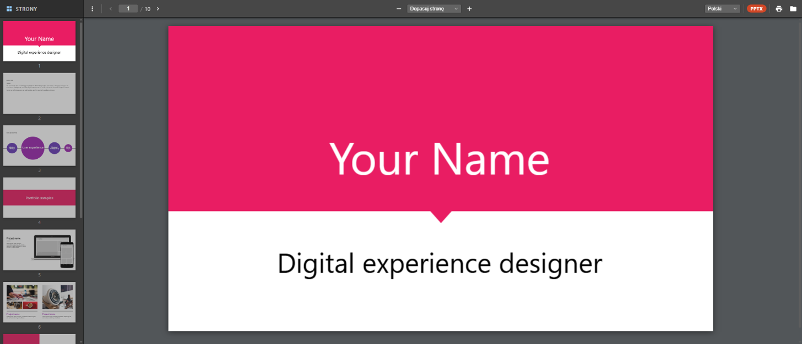

# ReaderJS — Universal Document Viewer

A browser-based document viewer that renders **PDF, ODF, RTF, DOC, DOCX, Markdown, plain text, images, comic-book archives, e-books (EPUB/MOBI), web archives (MHTML), Compiled HTML Help (CHM), and PostScript/EPS** natively in the browser — no server, no upload, no conversion. Everything runs client-side; your files never leave your machine.

To give it a try without installing anything, visit the [live demo](https://alpaq92.github.io/ReaderJS/).



---

## Supported Formats

| Format | Extension(s) | Engine |
|--------|-------------|--------|
| PDF | `.pdf` | PDF.js (Mozilla) |
| PostScript / EPS | `.ps` `.eps` `.epsf` | Riposte |
| DjVu | `.djvu` `.djv` | DejaView |
| ODF — Writer, Calc, Impress | `.odt` `.ods` `.odp` `.odg` | JSZip + DOMParser |
| Rich Text Format | `.rtf` | RTF.js |
| Legacy Word 97–2003 | `.doc` | JSDoc |
| Word Open XML | `.docx` | mammoth.js |
| PowerPoint | `.pptx` | PptxViewJS |
| Spreadsheet | `.xlsx` `.xls` `.xlsm` `.xlsb` | SheetJS |
| Markdown | `.md` `.markdown` | marked |
| Plain text | `.txt` `.text` `.log` | native |
| CSV / TSV | `.csv` `.tsv` | Papa Parse |
| Source code | `.js` `.ts` `.json` `.xml` `.yaml` `.py` … | highlight.js |
| Image (+ EXIF) | `.png` `.jpg` `.gif` `.webp` `.avif` `.bmp` `.svg` `.tiff` | native + UTIF.js (TIFF) + exifr (EXIF) |
| Comic Book Archive | `.cbz` `.cbr` `.cbt` | JSZip (CBZ) + libarchive.js (CBR/CBT) |
| E-book | `.epub` `.mobi` `.azw3` `.fb2` | foliate-js |
| Web archive (MHTML) | `.mht` `.mhtml` | mhtml-to-html |
| Compiled HTML Help | `.chm` | CHMate |

## Features

- PDF.js-inspired UI — sidebar thumbnails, page navigation, zoom, print
- Drag & drop or browse to open files
- Compare two document versions (PDF, DjVu, e-books, Office, text) — side-by-side / unified / inline, with word-level highlights, pinnable blame-aware tooltips, and page-by-page diff for multi-page PDF/DjVu
- Client-side only — documents are never uploaded or transmitted
- Multilingual UI — auto-detects your browser language with a manual switcher (English, Polish, Spanish, French, German, Portuguese, Chinese, Japanese, Russian)

## Embedding

ReaderJS can be embedded into another app as a read-only, self-contained,
same-origin viewer that takes document **bytes + a filename** (no upload UI):

```js
const inst = ReaderJS.mount(container, { blob, name: 'report.pdf' })
```

Build the vendorable artifact with `npm run build:embed` (→ `dist-embed/`). See
[EMBEDDING.md](EMBEDDING.md) for the full API, the `?src` iframe variant, and the
CSP asset list.

## Running Locally

```bash
git clone https://github.com/Alpaq92/ReaderJS.git
cd ReaderJS
npm install
npm run dev
```

## Credits

ReaderJS is built on these open-source libraries:

| Library | Author / Source | Role |
|---------|----------------|------|
| **[PDF.js](https://github.com/mozilla/pdf.js)** | Mozilla Foundation | PDF rendering (via `pdfjs-dist`) |
| **[DejaView](https://github.com/Alpaq92/dejaview)** | Alpaq92 | Pure-JS DjVu decoder/renderer — clean-room implementation of the public format (cross-referenced against MIT [DjvuNet](https://github.com/DjvuNet/DjvuNet)), no GPL DjVuLibre code |
| **[JSDoc](https://github.com/Alpaq92/JSDoc)** | Alpaq92 | Binary `.doc` (Word 97–2003) reading and rendering — pure JS, zero dependencies, clean-room [MS-CFB] / [MS-DOC] implementation |
| **[mammoth.js](https://github.com/mwilliamson/mammoth.js)** | Michael Williamson | `.docx` (Word Open XML) → HTML conversion |
| **[PptxViewJS](https://github.com/gptsci/pptxviewjs)** | Alex Wong / gptsci | `.pptx` (PowerPoint) slide rendering to canvas |
| **[SheetJS](https://sheetjs.com/)** | SheetJS LLC | `.xlsx` / `.xls` spreadsheet → HTML tables (Apache-2.0) |
| **[Papa Parse](https://www.papaparse.com/)** | Matt Holt | CSV / TSV parsing |
| **[highlight.js](https://highlightjs.org/)** | Highlight.js contributors | Syntax highlighting for source-code files |
| **[RTF.js](https://github.com/tbluemel/rtf.js)** | tbluemel | RTF document rendering, including EMFJS and WMFJS for Windows metafile graphics |
| **[JSZip](https://github.com/Stuk/jszip)** | Stuk | ODF / ZIP container reading |
| **[jQuery](https://github.com/jquery/jquery)** | OpenJS Foundation | DOM utility required internally by RTF.js |
| **[marked](https://github.com/markedjs/marked)** | Christopher Jeffrey et al. | Markdown → HTML parsing and rendering |
| **[jsdiff](https://github.com/kpdecker/jsdiff)** | Kevin Decker | Text diffing engine behind the two-version compare view (BSD-3) |
| **[libarchive.js](https://github.com/nika-begiashvili/libarchivejs)** | Nika Begiashvili | CBR/CBT (RAR/TAR) extraction via a WASM build of libarchive — uses libarchive's own BSD-licensed RAR decoder, no UnRAR code |
| **[foliate-js](https://github.com/johnfactotum/foliate-js)** | John Factotum | EPUB / MOBI / KF8 (AZW3) / FB2 parsing and paginated rendering |
| **[mhtml-to-html](https://github.com/gildas-lormeau/mhtml-to-html)** | Gildas Lormeau | MHTML (`.mht` / `.mhtml`) web archives → one self-contained HTML document |
| **[CHMate](https://github.com/Alpaq92/CHMate)** | Alpaq92 | Pure-JS Microsoft Compiled HTML Help (`.chm`) reader — ITSF container + LZX decompression + sanitizing topic renderer, no WASM |
| **[Riposte](https://github.com/Alpaq92/Riposte)** | Alpaq92 | Pure-JS PostScript / EPS interpreter and renderer — rasterizes each page to `<canvas>`, zero runtime deps, no WASM |
| **[UTIF.js](https://github.com/photopea/UTIF.js)** | Photopea | TIFF image decoding |
| **[exifr](https://github.com/MikeKovarik/exifr)** | Mike Kovarik | EXIF / GPS metadata parsing for images |
| **[Vite](https://github.com/vitejs/vite)** | Evan You / Vite contributors | Build tooling and development server |
| **[Material Design Icons](https://pictogrammers.com/library/mdi/)** | Pictogrammers | UI icons (Apache-2.0) |
| **[Open-Color](https://github.com/yeun/open-color)** | Heeyeun Jeong | Colour palette for the compare / diff view |

Every library above is a normal **npm dependency** — `npm install` is all you
need, no git submodules. The four that aren't published to npm
([foliate-js](https://github.com/johnfactotum/foliate-js) for e-books,
[DejaView](https://github.com/Alpaq92/dejaview) for DjVu,
[CHMate](https://github.com/Alpaq92/CHMate) for CHM, and
[Riposte](https://github.com/Alpaq92/Riposte) for PostScript) are pinned to
commits as git dependencies in `package.json`. Every engine is permissively licensed
(MIT / BSD / Apache-2.0 / 0BSD).

## Gallery

Screenshots are in the [`gallery/`](gallery/) folder.

## License

MIT © 2026 Alpaq92 — see [LICENSE](LICENSE)
